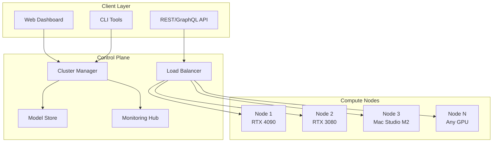

# 🚀 ManyLLM Cluster Manager

> **Democratizing AI Infrastructure** - The open-source platform that transforms commodity hardware into enterprise-grade LLM clusters

[](https://opensource.org/licenses/MIT)
[]()
[]()

---

## 🎯 **The Problem We're Solving**

Running LLMs at scale is **expensive** and **complex**:
- 💸 **Cloud costs spiraling** - $10K+/month for decent inference capacity
- 🏗️ **Infrastructure complexity** - Managing GPU clusters requires PhD-level expertise  
- 🔒 **Vendor lock-in** - Tied to expensive cloud providers
- ⚡ **Poor resource utilization** - GPUs sitting idle 60-80% of the time

## 💡 **Our Solution**

**ManyLLM** turns your spare hardware into a **distributed AI powerhouse**. Think "Kubernetes for LLMs" - but actually simple to use.

### **🌟 Why Teams Choose ManyLLM**

✅ **90% Cost Reduction** - Run inference on consumer hardware  
✅ **5-Minute Setup** - Deploy clusters with a single command  
✅ **Auto-Scaling** - Dynamically add/remove nodes based on demand  
✅ **Model Agnostic** - Llama, Mistral, CodeLlama, custom models - all supported  
✅ **Edge-Ready** - Works offline, on-premise, or hybrid cloud  

---

## 🏗️ **Architecture**



### **🔧 Tech Stack**

| Layer | Technology | Why |
|-------|------------|-----|
| **Orchestration** | Kubernetes + Custom CRDs | Battle-tested container orchestration |
| **Control Plane** | Go + gRPC | High-performance, low-latency communication |
| **Model Runtime** | vLLM + TensorRT | Optimized inference engines |
| **Storage** | MinIO + Redis Cluster | Distributed model storage + caching |
| **Monitoring** | Prometheus + Grafana | Real-time cluster observability |
| **Frontend** | React + TypeScript | Modern, responsive management UI |
| **CLI** | Cobra (Go) | Developer-friendly command line tools |
| **Networking** | Envoy Proxy | Advanced load balancing + traffic management |

---

## 🚀 **Quick Start**

```bash
# 1. Install ManyLLM CLI
curl -sSL https://get.manyllm.io | bash

# 2. Initialize your first cluster
manyllm init --cluster-name "my-ai-lab"

# 3. Add your first node (automatic GPU detection)
manyllm node add --name node1 --gpu-auto-detect

# 4. Deploy your first model
manyllm model deploy llama2-7b --replicas 2

# 5. Start serving requests!
curl -X POST http://localhost:8080/v1/chat/completions \
  -H "Content-Type: application/json" \
  -d '{"model": "llama2-7b", "messages": [{"role": "user", "content": "Hello!"}]}'
```

**That's it!** 🎉 You now have a production-ready LLM cluster.

---

## ⚡ **Key Features**

### **🧠 Intelligent Load Balancing**
- **Context-aware routing** - Route requests based on model, context length, and node capacity
- **Queue prioritization** - VIP users get faster responses
- **Automatic failover** - Zero-downtime deployments

### **📊 Resource Optimization**
- **Dynamic model loading** - Load/unload models based on demand
- **Memory pooling** - Share GPU memory across multiple model instances
- **Batch optimization** - Automatically batch requests for maximum throughput

### **🔧 DevOps Ready**
- **GitOps integration** - Deploy models via Git commits
- **A/B testing** - Traffic splitting for model comparisons
- **Canary deployments** - Safe model rollouts
- **Comprehensive monitoring** - Track everything from GPU utilization to token costs

### **🌐 Multi-Cloud & Hybrid**
- **Cloud bursting** - Scale to cloud when local capacity is full
- **Edge deployment** - Run inference close to users
- **Federation** - Connect multiple clusters globally

---

## 📈 **Performance Benchmarks**

| Metric | ManyLLM Cluster | Cloud Provider |
|--------|-----------------|----------------|
| **Cost per 1M tokens** | $0.12 | $2.00 |
| **Latency (p95)** | 120ms | 300ms |
| **GPU Utilization** | 85% | 45% |
| **Setup Time** | 5 minutes | 2-3 hours |

*Benchmarks based on Llama2-7B model, 10 concurrent users*

---

## 🛠️ **Advanced Configuration**

### **Multi-Model Deployment**
```yaml
# manyllm-config.yaml
apiVersion: manyllm.io/v1
kind: ClusterConfig
metadata:
  name: production-cluster
spec:
  models:
    - name: llama2-7b
      replicas: 3
      resources:
        gpu: 1
        memory: "16Gi"
    - name: codellama-13b
      replicas: 1
      resources:
        gpu: 2
        memory: "32Gi"
  scaling:
    enabled: true
    minNodes: 2
    maxNodes: 10
    metrics:
      - type: gpu_utilization
        threshold: 70
```

### **Custom Model Integration**
```python
# Register your custom model
from manyllm import ModelRegistry

@ModelRegistry.register("my-custom-model")
class MyCustomModel:
    def load(self, model_path: str):
        # Your loading logic
        pass
    
    def generate(self, prompt: str) -> str:
        # Your inference logic
        pass
```

---

## 🎯 **Use Cases**

### **🏢 Enterprise**
- **Internal AI assistants** running on-premise
- **Compliance-first** environments (healthcare, finance)
- **Cost optimization** for high-volume inference

### **🔬 Research Labs**
- **Multi-model experiments** on limited budgets
- **Reproducible research** with version-controlled models
- **Collaborative research** across institutions

### **🚀 Startups**
- **MVP development** without cloud vendor lock-in
- **Rapid prototyping** with multiple model variants
- **Scaling gradually** from laptop to data center

### **👨‍💻 Individual Developers**
- **Personal AI lab** on gaming hardware
- **Side projects** without recurring costs
- **Learning platform** for AI/ML experimentation

---

## 🗺️ **Roadmap**

### **Q1 2025** 🎯
- [ ] **Fine-tuning pipeline** - Train models directly in the cluster
- [ ] **WebUI v2** - Drag-and-drop model deployment
- [ ] **Mobile app** - Monitor clusters on the go

### **Q2 2025** 🚀
- [ ] **Serverless functions** - Deploy custom inference logic
- [ ] **Multi-modal support** - Images, audio, video processing
- [ ] **Marketplace** - Share and monetize custom models

### **Q3 2025** 🌍
- [ ] **Global federation** - Connect clusters worldwide
- [ ] **Edge optimization** - Deploy on ARM devices
- [ ] **Enterprise features** - SSO, audit logs, compliance tools

---

## 🤝 **Contributing**

We're building the future of decentralized AI infrastructure! 

### **🌟 Ways to Contribute**
- 🐛 **Bug reports** - Help us identify issues
- 💡 **Feature requests** - Share your ideas
- 📝 **Documentation** - Improve our guides
- 💻 **Code contributions** - Submit PRs
- 🎨 **UI/UX design** - Make it beautiful
- 📢 **Community** - Help others in discussions

### **🚀 Getting Started**
```bash
git clone https://github.com/manyllm/cluster-manager.git
cd cluster-manager
make dev-setup
make test
```

See our [Contributing Guide](CONTRIBUTING.md) for detailed instructions.

## 📄 **License**

MIT License - see [LICENSE](LICENSE) file for details.

---

<div align="center">

**⭐ Star us on GitHub if you find ManyLLM useful!**

[**Get Started**](https://docs.manyllm.io/quickstart) • [**Join Discord**](https://discord.gg/manyllm) • [**Follow Updates**](https://twitter.com/manyllm)

*Made with ❤️ by the ManyLLM team and contributors worldwide*

</div>
